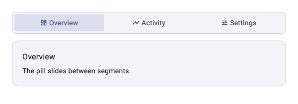
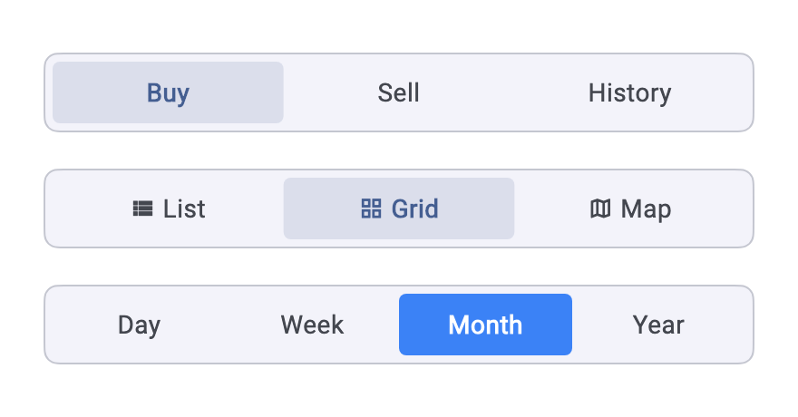
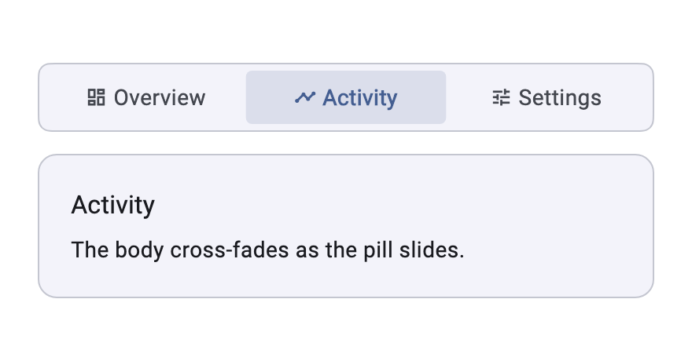

# sliding_segmented_control

A segmented control whose selection is marked by a **pill that slides** between
segments, rather than by a highlighted button — plus `SegmentedBody`, which
pairs the control with a body that cross-fades as the pill moves.

It has **no dependencies at all** — not on your app's theme, assets or
localisations, and none on pub.dev. Colours, shapes and metrics come from a
`ThemeExtension` you register, and with none registered it derives a palette
from the ambient `ColorScheme`.



The control in three styles — default, with icons, and with a solid indicator:



And a `SegmentedBody`, the control above the body of the selected segment:



## Install

```bash
flutter pub add sliding_segmented_control
```

Or add it to `pubspec.yaml` yourself — it is a runtime dependency:

```yaml
dependencies:
  sliding_segmented_control: ^0.1.1
```

then:

```bash
flutter pub get
```

## Use

The control on its own, driven by you:

```dart
SlidingSegmentedControl(
  segments: const [
    Segment(label: 'Buy'),
    Segment(label: 'Sell'),
    Segment(label: 'History'),
  ],
  selectedIndex: _index,
  onSegmentChanged: (i) => setState(() => _index = i),
)
```

Or the control with its body, keeping the selection for you:

```dart
SegmentedBody(
  pages: [
    SegmentPage.of(label: 'Open', child: const OpenPositions()),
    SegmentPage.of(label: 'Closed', child: const ClosedPositions()),
  ],
)
```

Only the selected page is built, so the others cost nothing until they are
picked. Pass `selectedIndex` and `onSegmentChanged` to drive it yourself
instead.

### `SlidingSegmentedControl`

| Parameter | Default | Meaning |
| --- | --- | --- |
| `segments` | — | The segments, sharing the width equally. Must not be empty |
| `selectedIndex` | — | Index of the selected segment |
| `onSegmentChanged` | — | Called with the tapped index |
| `enabled` | `true` | Whether the control accepts taps at all |
| `duration` | 250 ms | How long the indicator takes to slide |
| `curve` | `easeInOut` | The curve it slides on |
| `height` | theme | Overrides the theme's height |
| `padding` | theme | Inset between the track edge and the segments |
| `trackRadius` / `indicatorRadius` | theme | Per-instance corner radii |
| `trackShape` / `indicatorShape` | theme | Per-instance `ShapeBorder`s, overriding the radii |
| `labelStyle` / `selectedLabelStyle` | theme | Per-instance text styles |
| `trackColor`, `indicatorColor`, `selectedLabelColor`, `unselectedLabelColor` | theme | Per-instance colours |
| `semanticLabel` | null | Screen-reader label for the control as a whole |

A `Segment` is a `label`, an optional `icon`, and `enabled` — a disabled
segment is dimmed and ignores taps. It also takes a `semanticLabel` and a
`tooltip`.

### `SegmentedBody`

| Parameter | Default | Meaning |
| --- | --- | --- |
| `pages` | — | `SegmentPage`s: a segment and the body it shows |
| `selectedIndex` | null | Pass it to control the selection; leave null to let the widget keep it |
| `initialIndex` | `0` | The index selected first, when uncontrolled |
| `onSegmentChanged` | null | Called with the new index, in both modes |
| `spacing` | `14` | Gap between the control and the body |
| `controlMargin` | `zero` | Padding around the control, outside its track |
| `bodyExpanded` | `false` | Whether the body fills the remaining height |
| `bodyDuration` | 200 ms | How long the body takes to change |
| `bodyTransition` | `fade` | One of the ready-made transitions below |
| `transitionBuilder` | null | A transition of your own, overriding `bodyTransition` |

Leave `bodyExpanded` false inside a scroll view, where the height is unbounded.

### Body transitions

```dart
SegmentedBody(
  bodyTransition: SegmentedBodyTransition.slide,
  pages: [...],
)
```

| `SegmentedBodyTransition` | What it does |
| --- | --- |
| `fade` | The bodies cross-fade in place. The default, and the cheapest |
| `slide` | The incoming body slides in from the side the selection moved towards while the outgoing one leaves the other way, fading across |
| `scale` | The incoming body grows into place as the outgoing one shrinks away |

`slide` is direction-aware: picking a later segment brings the body in from the
end side, picking an earlier one brings it from the start side, and both are
mirrored under `TextDirection.rtl`. It reads the direction from the selection
itself, so it works the same whether the widget keeps the selection or you do.

For anything else, pass a `transitionBuilder` — it takes precedence over
`bodyTransition`:

```dart
SegmentedBody(
  transitionBuilder: (child, animation) =>
      RotationTransition(turns: animation, child: child),
  pages: [...],
)
```

## Theming

Register a `SegmentedControlTheme` so every control in the app is styled in one
place, and follows your light and dark themes:

```dart
MaterialApp(
  theme: ThemeData(
    extensions: [
      SegmentedControlTheme(
        trackColor: scheme.surfaceContainerLow,
        borderColor: scheme.outlineVariant,
        indicatorColor: scheme.primary.withValues(alpha: 0.14),
        selectedLabelColor: scheme.primary,
        unselectedLabelColor: scheme.onSurfaceVariant,
      ),
    ],
  ),
);
```

Every field is optional beyond those five, and the widget's own parameters win
over whatever the extension says.

| Field | Default | Meaning |
| --- | --- | --- |
| `trackColor` | — | Background behind the segments |
| `borderColor` / `borderWidth` | — / `1` | The track outline. Width `0` drops it |
| `indicatorColor` | — | Fill of the sliding pill |
| `selectedLabelColor` | — | Label and icon of the selected segment |
| `unselectedLabelColor` | — | Label and icon of every other segment |
| `disabledLabelColor` | 38% of unselected | Label of disabled segments |
| `labelStyle` / `selectedLabelStyle` | ambient `bodyMedium` | Text styles. What they set wins |
| `fontFamily` | null | Swaps the typeface without touching the styles |
| `trackRadius` / `indicatorRadius` | 8 / 4 | Corner radii. Any `BorderRadiusGeometry` |
| `trackShape` / `indicatorShape` | rounded | Full `ShapeBorder`s, overriding the radii |
| `smoothCorners` | `true` | Squircle corners, or plain circular ones |
| `trackPadding` | `4` | Inset between the track edge and the segments |
| `height` | `44` | Height of the whole control |
| `iconSize` / `iconLabelSpacing` | `14` / `4` | Segment icon metrics |
| `indicatorShadows` | none | Shadows cast by the pill |

With no extension registered, `SegmentedControlTheme.of` falls back to
`SegmentedControlTheme.fromScheme(Theme.of(context).colorScheme)` — a tinted
indicator on a surface track — so the control is usable with no setup.

`copyWith` and `lerp` are implemented, so the control animates across a theme
change like any other `ThemeExtension`.

### Corners

`trackRadius` and `indicatorRadius` take **any** `BorderRadiusGeometry` — one
radius for all four corners, a different radius per corner, elliptical corners,
or `BorderRadiusDirectional`, which the shape resolves against the ambient text
direction:

```dart
SlidingSegmentedControl(
  trackRadius: const BorderRadius.only(
    topLeft: Radius.circular(22),
    bottomRight: Radius.elliptical(12, 6),
  ),
  indicatorRadius: BorderRadius.circular(18),
  // …
)
```

By default the corners are drawn as a superellipse — the smoothed, iOS-style
squircle — through Flutter's own `RoundedSuperellipseBorder`, which the engine
rasterises directly. Set `smoothCorners: false` on the theme for plain circular
corners.

For corner geometry this package does not ship, pass a whole `ShapeBorder` as
`trackShape` / `indicatorShape`, on the theme or per instance. That is the seam
for a `StadiumBorder`, your own `ShapeBorder`, or a squircle from a package
such as `figma_squircle` — the shape comes from you, so the dependency stays in
your app rather than in this one:

```dart
SlidingSegmentedControl(
  trackShape: SmoothRectangleBorder(
    borderRadius: SmoothBorderRadius(cornerRadius: 8, cornerSmoothing: 1),
  ),
  // …
)
```

## Right-to-left

The indicator is positioned with `AlignmentDirectional`, so under
`TextDirection.rtl` the first segment is on the right and the pill slides
leftwards. Nothing to configure.

## Accessibility

Each segment is exposed as a button carrying its selected and enabled state,
with a tap action, labelled by `Segment.semanticLabel` or its label. Note the
default `height` of 44 is under the 48 dp minimum tap target — raise it on the
theme where that matters.

## Testing against it

The sliding indicator carries `SlidingSegmentedControl.indicatorKey`, so host
tests can find and measure it:

```dart
final pill = tester.getRect(
  find.byKey(SlidingSegmentedControl.indicatorKey),
);
```

## Example

A runnable demo of every style, including the RTL toggle, is in
[`example/`](example/lib/main.dart):

```bash
cd example && flutter run
```

The images in this README are rendered from the real widgets, so they can be
regenerated whenever the control changes:

```bash
cd example && flutter test --update-goldens test/screenshots_test.dart && flutter test tool/record_tab_gif.dart
```

## Licence

MIT — see [LICENSE](LICENSE).
